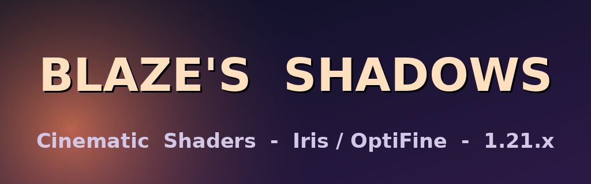

<p align="center">
  
</p>

<h1 align="center">Blaze's Shadows</h1>

<p align="center">
  <b>A modern, cinematic, highly optimized Minecraft shader pack.</b><br>
  Physically-inspired lighting · volumetric everything · procedural skies · beautiful water.<br>
  Built for <b>Iris</b> and <b>OptiFine</b> · Minecraft <b>1.21.x</b> (works back to 1.16.5).
</p>

---

## ✨ Overview

**Blaze's Shadows** is a deferred, HDR shader pipeline that aims for the visual quality
of packs like Complementary Reimagined, BSL, SEUS PT, Solas, Photon and Bliss — while
keeping its own warm, natural-yet-colorful identity and staying friendly to mid-range
GPUs through five quality presets and a fully featured settings menu.

Everything is real, working GLSL — there are no stubs or placeholders. Every stage is
documented, the code is split into reusable libraries under `shaders/lib`, and per-
dimension behaviour lives in `world0` / `world-1` / `world1` overrides.

## 🚀 Installation

1. Install **[Iris](https://irisshaders.dev/)** (recommended) *or* **[OptiFine](https://optifine.net/)** for Minecraft **1.21.x**.
2. Download / clone this repository and **zip the contents** so that the archive contains
   the `shaders/` folder at its root (i.e. `BlazesShadows.zip/shaders/...`).
   *A convenience script is provided:* `bash tools/package.sh`.
3. Drop the resulting `BlazesShadows.zip` into your `.minecraft/shaderpacks` folder.
4. In-game: **Options → Video Settings → Shaders** (OptiFine) or **Shader Packs** (Iris),
   select **Blaze's Shadows**, and tweak to taste.

> **Tip:** the first thing to set is the **Quality Profile** screen — pick Low → Extreme.
> Everything else can be fine-tuned per-feature afterwards.

## 🎛️ Quality presets

| Preset  | Shadows | SSAO/SSGI | Volumetrics | Clouds | Reflections | Extras |
|---------|:-------:|:---------:|:-----------:|:------:|:-----------:|--------|
| Low     | 1024, hard | off | off | 2D | off | render 70% |
| Medium  | 1536, PCF | SSAO | god rays | volumetric | SSR | wet surfaces |
| High    | 2048, PCSS | SSAO+SSGI | full | volumetric | SSR+rough | aurora, milky way |
| Ultra   | 3072, PCSS | SSAO+SSGI | full | volumetric | SSR+rough | motion blur |
| Extreme | 4096, PCSS | SSAO+SSGI | full | volumetric | SSR+rough | grain, DoF |

## 🌟 Feature highlights

<details open>
<summary><b>Lighting & Shadows</b></summary>

- Physically based BRDF (GGX + Smith + Burley diffuse), energy conserving.
- Dynamic sun & moon with colour-temperature-correct light and soft global illumination.
- Ultra-high-quality shadows: distortion "cascade", **PCSS contact hardening**, PCF soft
  penumbra, coloured shadows (stained glass / water), plus **screen-space contact shadows**.
- Warm, colour-graded block light + emissive blocks/ores/mob eyes + handheld light.
- SSAO (Alchemy horizon estimate) and single-bounce **SSGI**.
- Volumetric light shafts (god rays) marched through the shadow map.
</details>

<details>
<summary><b>Sky & Atmosphere</b></summary>

- Procedural analytic sky (Rayleigh gradient + Mie glow) with golden sunrise / orange sunset.
- Ray-marched **volumetric clouds** (Beer-Powder lighting) with storm build-up in rain.
- Procedural star field, **Milky Way**, **shooting stars**, **aurora borealis**, and a
  post-rain **rainbow**.
</details>

<details>
<summary><b>Water & Weather</b></summary>

- Animated Gerstner-ish waves, per-channel depth absorption, screen-space refraction,
  Fresnel sky reflection + SSR, animated caustics, shoreline/crest foam and rain ripples.
- Wet surfaces darken and gloss up in the rain; dynamic fog and storm clouds.
</details>

<details>
<summary><b>Post-processing</b></summary>

- HDR pipeline with **auto-exposure / eye adaptation**, five tonemap operators
  (Reinhard, ACES, Uchimura GT, AgX, Lottes), soft-knee **HDR bloom**.
- Full colour grading (brightness, contrast, saturation, vibrance, gamma, white balance,
  tint), **TAA**, optional FXAA, sharpen, vignette, chromatic aberration, motion blur,
  film grain and depth of field.
</details>

<details>
<summary><b>World detail</b></summary>

- Waving grass, leaves, flowers, crops, vines, kelp & seagrass.
- Dynamic entity shadows, torch light on players, glowing entities & mob eyes.
- Nether: hot ambient, heat haze, volumetric smoke, better lava.
- End: bespoke purple void sky, nebula, drifting particles.
- labPBR 1.3 support (normal + specular + parallax occlusion mapping) with graceful
  vanilla fallback.
</details>

## 🗂️ Project structure

```
pack.png                      # pack icon
README.md · LICENSE · CHANGELOG.md
presets/                      # example look presets you can paste into your config
screenshots/                  # gallery
docs/                         # extra documentation (pipeline, tuning)
tools/                        # asset generation + packaging helpers
shaders/
  shaders.properties          # settings menu, profiles, pipeline config
  block.properties            # block -> id tagging (waving / emissive)
  lang/                       # en_US, es_ES, zh_CN menu translations
  textures/                   # logo + icon
  *.vsh / *.fsh               # gbuffers, shadow, deferred, composite, final programs
  world0/ world-1/ world1/    # per-dimension overrides (Overworld / Nether / End)
  lib/
    settings.glsl             # every user option lives here
    util/                     # math, encoding, noise, spaces, blackbody, constants
    atmosphere/               # sky, clouds, celestial, fog
    lighting/                 # shadows, brdf, distortion
    material/                 # labPBR decode, material ids
    water/                    # waves, caustics, foam, ripples
    vertex/                   # wind / vegetation displacement
    post/                     # tonemap, bloom, colour grade
```

## 🧩 Render pipeline at a glance

`gbuffers_*` → `shadow` → `deferred` (SSAO/SSGI) → `deferred1` (lighting + sky + clouds +
god rays) → *translucents* (`gbuffers_water`) → `composite` (SSR) → `composite1` (fog) →
`composite2` (TAA + auto-exposure) → `composite3–7` (bloom) → `final` (tonemap, grade, post).

See [`docs/PIPELINE.md`](docs/PIPELINE.md) for the full data-flow and G-buffer layout.

## 🖼️ Screenshots

Place your captures in `screenshots/` — see [`screenshots/README.md`](screenshots/README.md)
for the recommended shots. (Screenshots require running the pack inside Minecraft.)

## 🛠️ Compatibility notes

- Written in `#version 330 compatibility`, which both Iris and OptiFine support.
- Works without a PBR resource pack (sensible fallbacks); shines with a labPBR one.
- POM is **off by default** (needs height maps) — enable it under *Materials & PBR*.

## 📜 License

See [`LICENSE`](LICENSE). Free to use and modify; please credit **Blaze's Shadows** and
do not re-upload or sell it as your own.

## 🙌 Credits

Created as **Blaze's Shadows**. Techniques inspired by the open shader community
(PCSS, Alchemy AO, Beer-Powder cloud lighting, ACES/AgX tonemapping, octahedral normal
encoding). All code in this repository was written for this pack.
